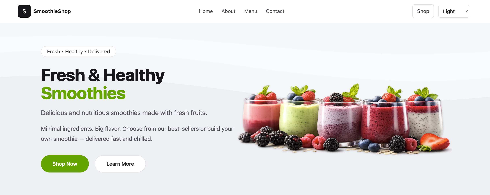
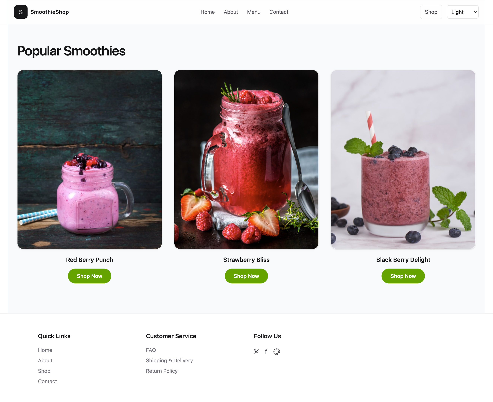
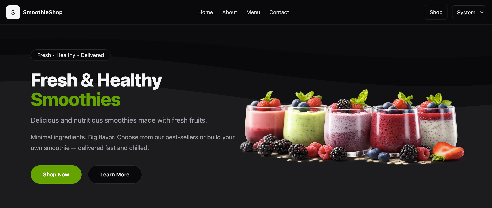
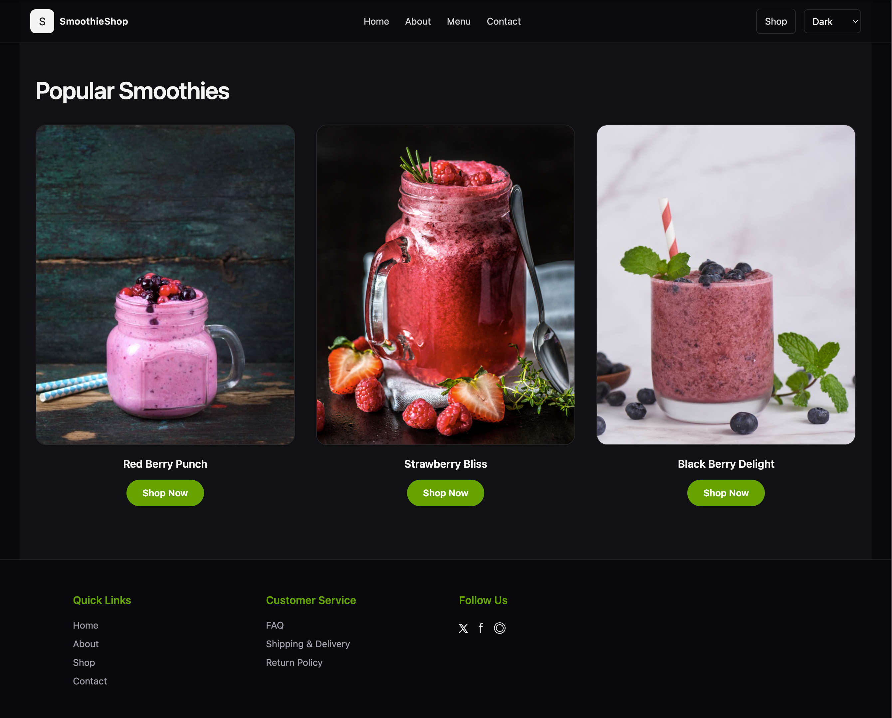

# SmoothieShop Landing Page

A clean, modern, responsive landing page built with **React + Vite + Tailwind CSS**.

This project focuses on layout structure, visual hierarchy, dark/light mode support, and a premium hero section with free‑flowing imagery.

---

Live Demo: https://smoothie-page.vercel.app/
Repository: https://github.com/SubDan12/Smoothie-Page

---

## ScreenShots






---

## Tech Stack

- React (Vite)
- Tailwind CSS
- Responsive Grid Layout
- Dark / Light Mode Toggle

---

## Features

- Responsive design (mobile → desktop)
- Free‑flow hero image layout
- SVG background decoration
- Clean typography hierarchy
- Reusable section structure
- Product showcase cards
- Dark / Light theme support

---

## Project Structure

```
src/
 ├── components/
 ├── sections/
 ├── assets/
 ├── App.jsx
 └── main.jsx
```

---

## Installation

```bash
npm install
npm run dev
```

App runs at:

```
http://localhost:5173
```

---

## Purpose

This project was built to practice:

- Advanced layout positioning (absolute vs grid flow)
- Hero section composition
- Visual balance in landing pages
- Responsive behavior handling
- Clean UI structuring for freelancing portfolio use

---

## Preview

Includes:

- Hero Section
- About Section
- Why Choose Us
- Popular Smoothies
- Footer

---

## Future Improvements

- Add animations (Framer Motion)
- Connect to real product data
- Add cart functionality
- Improve accessibility (ARIA + keyboard focus states)
